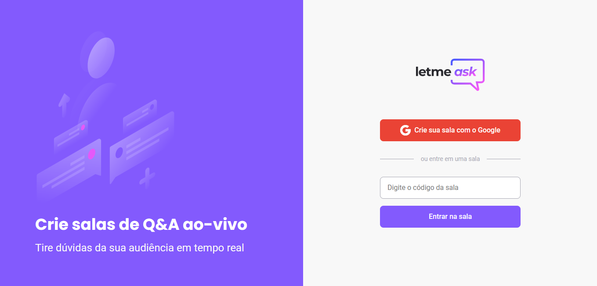

<h1 align="center">
  
</h1>

  

 

## 💻 Conceito do Projeto

Letmeask é uma plataforma simples para Q&A (perguntas e respostas), onde você pode criar uma sala e convidar amigos ou seguidores para lhe sugerirem temas e você possa organizar elas.

## 🔨 Funções originais do projeto 

- Autenticação e Armazenamento via Firebase
- Estilização usando SASS
- Desenvolvimento de componentes, hooks e contexts

- Criação de salas
- Envio de perguntas
- Destaque, marcação e exclusão de perguntas

## 🔨 Funções extras (Roadmap)

- [ ]  Adicionar modo escuro
- [ ]  Logoff
- [ ]  Botão de link nas perguntas respondidas
- [ ]  Trocar a ordem dos botões de Encerrar a sala e código da sala na tela de desenvolvedor

## ✨ Práticas e Tecnologias apresentadas

- Create React App
- Typescript
- Firebase
- Context API
- React Router DOM

## 📄 Licença

Esse projeto está sob a licença MIT. Veja o arquivo [LICENSE](LICENSE.md) para mais detalhes.